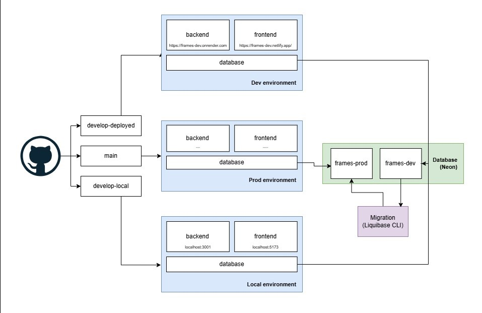
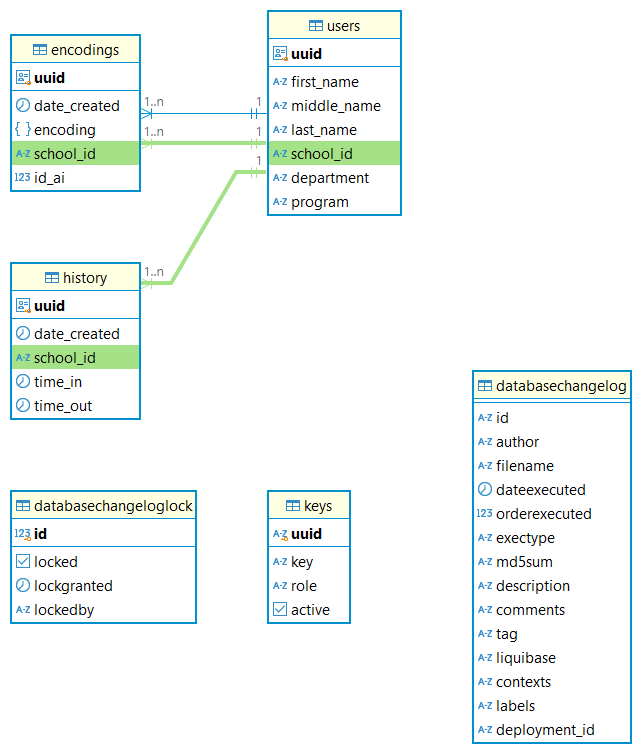
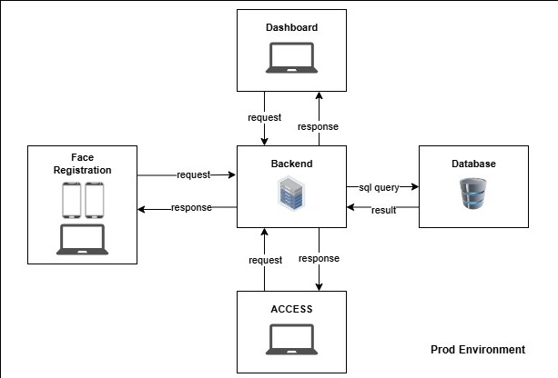

# FRAMES Backend Guide
This guide is intended for future maintainers of the **FRAMES** system. It includes essential maintenance aspects, covering routine maintenance, security, troubleshooting, and support for backend, deployment, and database components.

## System overview

-   **Architectural Diagram**: This section provides a high-level architecture diagram of FRAMES, illustrating how different components of the system interact and where it is currently deployed.

- **ERD Diagram** : This diagram depicts the database schema for the application, showing the various tables and their relationships.

- **High-level Diagram** : This high-level architecture diagram provides an overview of the key components and the general flow of information within the system, which can be useful for future maintainers to understand the system's structure and functionality.

## Structure
-   **Repository Structure**: FRAMES uses a **monorepo** approach. However, if future maintainers prefer a polyrepo structure, we suggest separating the backend, frontend, migrations, and CI/CD pipelines into individual repositories. Each repository should include a `.github/workflows` folder containing all automated testing workflows for different environments.

## Deployment & Environments

-   **Environments**: The application is deployed in two environments: `dev` (development) and `prod` (production).
    
    -   **Backend**: Hosted on the Render server.
    -   **Frontend**: Hosted on Netlify.
-   **Branching Strategy**: Each environment corresponds to a specific branch in the FRAMES repository:
    
    -   **develop** (dev environment)
    -   **main** (prod environment)
-   **Environment Separation**: If the budget permits, we recommend using separate virtual machine instances for the dev and prod environments (rather than separate repositories/branches), particularly if deploying in a cloud environment. On-premises deployment is also an option if preferred.
    
-   **Database**: Both dev and prod databases are currently hosted on the free tier of Neon.tech, but these can be moved to cloud-based or on-premises servers.

## Database Management

-   **Schema Migrations**: **Liquibase** is included to simplify migrations of schemas, views, and constraints from dev to prod databases. Use the Liquibase CLI commands provided in the `migration` folder, which also includes configuration properties for both dev and prod databases.
    
-   **Face Encoding Management**: To manage storage size, an SQL query is provided that automatically retains the five most recent student face encodings while removing older ones.

## Security Routine Procedures

**Package Management**: We recommend keeping frontend and backend packages updated to eliminate security vulnerabilities. Perform `npm run audit` twice a month to identify and update outdated packages with known vulnerabilities. You can also add dependabot to automate this task.

**Backup**: Always backup prod data. Currently it is not employed in our system, but you can use Dbeaver or automate it in a CI/CD pipeline.

## **WebSockets and Face Encoding Synchronization**

-   **WebSocket Integration**: The backend uses WebSocket with socket.io connections to synchronize face encodings with the frontend, where the face recognition algorithm runs to minimize latency.
    
-   **Frontend Storage**: The frontend uses **IndexedDB** via the **Dexie** library to store face encodings. The user endpoint includes a function that automatically synchronizes encodings between the frontend and backend.

## Recommendations
- **Code Quality and Standards**: -   Implement mandatory code reviews for all pull requests to maintain code quality and consistency. Establish and follow coding standards for each component (e.g., naming conventions, folder structure) and maintain them in the documentation. Use lintersand formatters (e.g., Prettier) to enforce consistent code style.

-   **Package Management**: Only add essential packages to avoid repository bloat and reduce potential security vulnerabilities.
-   **Environment Variables**: Avoid uploading `.env` files to the repository, even if it's private.
-   **Branch Maintenance**: Delete outdated branches that are no longer needed.
-   **Testing**: Ensure rigorous testing is conducted before deploying to the production environment.
-   **Cloud Migration**: We recommend transitioning deployment from free services (e.g., Neon, Render, Netlify) to a reliable cloud provider when feasible.
